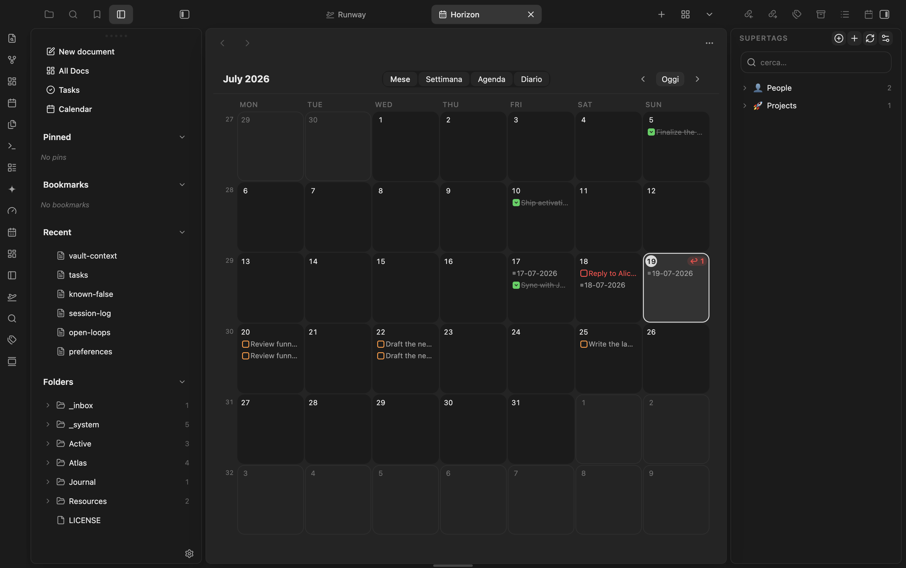

# SuperBaseTags

Tana-style **supertags for Obsidian**, built on the primitives you already have:
`#type/*` tags and [Bases](https://help.obsidian.md/bases). No new data model —
the plugin turns your existing collections into first-class object types.

```
SUPERTAGS            ⚙  +
────────────────────────
🔍 filtra…

📍 Concept           42
👤 Person            18
📄 Content            7
💡 Decision          23
🏢 Company           11
📚 Reference         56
🎯 Goal               9
```

Part of the marioverse Obsidian plugin suite.

<p align="center">
  
</p>
<p align="center"><em>Every collection with a live member count, one click away.</em></p>

## What it does

- **Sidebar hub** — every `.base` that filters a `type/*` tag shows up as a
  supertag: icon · name · live member count. Click to open its collection.
- **Expandable rows** — click the chevron to peek the first notes in a
  collection inline; open one, or jump to the full base.
- **Fuzzy filter** — the search box and inline picker rank matches with
  Obsidian's fuzzy matcher; press `Enter` to open the top hit, `Esc` to clear.
- **Type a note in one click** — "Apply supertag to current note" adds the
  `#type/X` tag *and* scaffolds the collection's fields as empty frontmatter
  (Tana-style). Toggle scaffolding off if you just want the tag.
- **Command palette** — every supertag gets an `Apply supertag: X` command you
  can bind to a hotkey.
- **Pin, icon, group** — light per-supertag customisation (emoji grid picker,
  group labels), stored in the plugin's `data.json`. Your `.base` files stay the
  source of truth.
- **Create supertags** — name it, get `type/<slug>` plus a starter `.base`.
- **Inline picker** (opt-in) — type `++` in the editor to fuzzy-pick and apply.
- **Row peek** — hover a Bases table row for an `OPEN` button (or run "Peek
  active note") to open a modal with editable properties + a rendered preview,
  Notion-style. Edits write straight to the note's frontmatter.
- **Pill colorizer** — colours tag/list chips in Bases views with a
  deterministic palette (`.mv-pill` classes), with per-value overrides in
  `data.json`. The required fallback styles ship with the plugin.

## How it maps

| Tana | Obsidian (this plugin) |
| --- | --- |
| supertag | tag `#type/X` |
| object type / collection | the `.base` filtering `file.hasTag("type/X")` |
| default fields | the note properties the base displays |
| apply supertag | add `#type/X` → note enters the base |

## Setup

The supertag namespace is **configurable** (default `type/`) and the plugin
scans the folders you set in settings. The default empty scope scans the whole
vault; set one or more folders to narrow it.

## Mobile

**Verified** — `isDesktopOnly: false` in `manifest.json`; `styles.css` ships a `pointer: coarse` media query extending small control hit areas to 44pt Apple HIG.

## Develop

```bash
pnpm install
pnpm dev      # watch + deploy into the vault (see .obsidian-plugin-dir)
pnpm build    # typecheck + production bundle
pnpm test     # vitest — unit tests for the pure logic (scanner, registry)
```

Create a `.obsidian-plugin-dir` file containing the absolute path to your
vault's plugin folder to auto-deploy on build. Source lives in `src/`.

## Try it

See it running in the [Obsidianverse sample vault](https://github.com/mariomile/obsidianverse-sample-vault), a small, fictional vault with the whole plugin suite pre-configured.

## License

MIT © Mario Miletta
